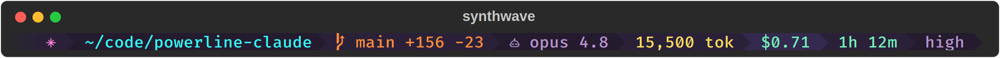

# powerline-claude

[](https://github.com/bcmyguest/powerline-claude/actions/workflows/ci.yml)
[](https://crates.io/crates/powerline-claude)
[](LICENSE)
[](https://docs.claude.com/en/docs/claude-code)

A powerline-style status line for [Claude Code](https://code.claude.com), as a
single Rust binary. Reads the statusline JSON Claude Code writes to stdin,
prints an ANSI bar.


Inspired by [starship-claude](https://github.com/martinemde/starship-claude),
using a [powerline-go](https://github.com/justjanne/powerline-go)-style API.

## Quick start

These are Claude Code slash commands, not shell commands: start a `claude`
session and enter each one _at the Claude prompt_, one at a time.

`/plugin marketplace add bcmyguest/powerline-claude`

`/plugin install powerline-claude@powerline-claude`

`/reload-plugins`

Then run the setup command (also inside Claude):

`/powerline-claude:configure`

It downloads the binary if it's missing, points `statusLine` in
`~/.claude/settings.json` at it, and walks you through theme, segments, and
separator mode.

## Manual install

Grab the static binary from the latest release:

```bash
curl -fsSL -o ~/.local/bin/powerline-claude \
  https://github.com/bcmyguest/powerline-claude/releases/latest/download/powerline-claude-x86_64-unknown-linux-musl
chmod +x ~/.local/bin/powerline-claude
```

or install from [crates.io](https://crates.io/crates/powerline-claude):

```bash
cargo install powerline-claude --locked
```

or build from source:

```bash
cargo install --git https://github.com/bcmyguest/powerline-claude --locked
```

## Usage

`~/.claude/settings.json`:

```json
{
  "statusLine": {
    "type": "command",
    "padding": 0,
    "command": "~/.local/bin/powerline-claude"
  }
}
```

Flags go on that command string:

| Flag | Default | Meaning |
|------|---------|---------|
| `--modules` | `logo,dir,git,model,context,cost,usage,stats,effort` | Segments to render, in order |
| `--modules-right` | (empty) | Segments pinned to the right edge of the terminal, e.g. `--modules-right context,cost` |
| `--theme` | `catppuccin-mocha` | Also: `catppuccin-frappe`, `dracula`, `gruvbox-dark`, `nord`, `tokyonight`, a path to a [custom theme directory](#custom-themes), or the name of one under `~/.config/powerline-claude/themes/` |
| `--mode` | `patched` | `patched` (nerd-font separators), `compatible` (plain-Unicode separators and segment icons — no patched font needed), `flat` (no separators) |
| `--no-progress` | off | Suppress the OSC 9;4 terminal progress bar |
| `--width` | `$COLUMNS`, then parent TTY, then 200 | Terminal width (drives dir truncation) |

## Custom themes

`--theme` accepts a filesystem path instead of a built-in name. When the value
resolves to an existing directory, powerline-claude reads `theme.yaml` from
inside it instead of looking up a vendored palette:

```bash
powerline-claude --theme ~/projects/my-theme
# reads ~/projects/my-theme/theme.yaml
```

Themes dropped under `~/.config/powerline-claude/themes/` can be selected by
bare name — any `--theme` value that isn't a built-in palette or an existing
directory path is looked up there:

```bash
powerline-claude --theme my-theme
# reads ~/.config/powerline-claude/themes/my-theme/theme.yaml
```

Built-in palette names always win, so a custom theme can't shadow `nord`.

`theme.yaml` defines fg/bg hex colors for the eight segment families
(`claude`, `directory`, `git`, `model`, `context`, `context_warn`,
`context_alert`, `cost`) plus an optional display `name`.
[`docs/themes/synthwave`](docs/themes/synthwave/theme.yaml)
is a complete example you can copy as a starting point:

```yaml
name: synthwave
claude: { fg: "#ff7edb", bg: "#2a2139" }
directory: { fg: "#36f9f6", bg: "#241b2f" }
git: { fg: "#ff8b39", bg: "#2a2139" }
model: { fg: "#b893ce", bg: "#241b2f" }
context: { fg: "#fede5d", bg: "#2a2139" }
context_warn: { fg: "#241b2f", bg: "#ff8b39" }
context_alert: { fg: "#241b2f", bg: "#fe4450" }
cost: { fg: "#72f1b8", bg: "#34294f" }
```



Every field is optional, right down to individual `fg`/`bg` values within a
family — anything left unspecified falls back to the corresponding
catppuccin-mocha color. `name` defaults to the directory's basename if
omitted. `stats`, `effort`, and `usage` aren't configurable directly; they
derive from `cost`/`context`, `model`, and `cost` respectively, same as the
built-in palettes.

## Segments

- `logo` — Claude glyph (`✳` in compatible mode)
- `dir` — workspace dir, last two path components (one below 80 columns)
- `git` — current branch (read from `.git/HEAD`, worktree-aware) plus the
  session's `+added -removed` line counts from the payload (`⎇` branch
  icon in compatible mode)
- `model` — nerd icon + lowercased model name (no icon in compatible mode)
- `context` — exact tokens in the context window (`150,697 tok`), `~~ tok`
  before the first API call; turns orange at 80k tokens and red at 125k
  (the `context_warn`/`context_alert` theme families)
- `cost` — session cost, `$X.XX`
- `usage` — remaining subscription rate-limit budget (`5h 77% · 7d 59%`:
  what's left of the rolling 5-hour and 7-day windows); hidden when the
  payload has no rate-limit data
- `stats` — session duration (`1h 12m`)
- `effort` — reasoning effort level; hidden when the model doesn't support it

Segments whose data is absent from the payload disappear rather than render
placeholders (except `context`, which shows `~~` like the old bar did).

The OSC 9;4 progress bar mirrors context usage: green below 40%, yellow to
60%, red above, full at the 80% compact threshold.

## Development

```bash
cargo test          # the suite: unit + fixture-driven integration tests
cargo clippy --all-targets -- -D warnings
cargo fmt
cargo build --release
```

Rendering is pure (`powerline_claude::run`: JSON in, ANSI out), so everything
is testable without a terminal; fixtures live in `tests/fixtures/`.

## Releasing

Releases are automatic. Every merge to `main` runs
`.github/workflows/release.yml`, which asks [git-cliff](https://git-cliff.org)
for the next semver based on the conventional commits since the last tag,
pushes that `vX.Y.Z` tag, builds the static `x86_64-unknown-linux-musl`
binary, publishes a GitHub release with a git-cliff changelog
(`feat` → minor, breaking → major, anything else → patch), and pushes the
crate to crates.io via [Trusted Publishing](https://crates.io/docs/trusted-publishing)
(the crate's crates.io settings must list this repo and `release.yml` as a
trusted publisher). Running the workflow manually re-publishes the latest
existing tag to crates.io without cutting a new release. The committed
`Cargo.toml` version is not bumped; the binary and the published crate are
stamped with the tag version at build time.

Commit messages follow [Conventional Commits](https://www.conventionalcommits.org),
enforced by a [pre-commit](https://pre-commit.com) `commit-msg` hook:

```bash
pre-commit install --install-hooks --hook-type pre-commit --hook-type commit-msg
```

## Plugin

`plugin/` is a small Claude Code plugin (registered via the repo-root
`.claude-plugin/marketplace.json`) providing `/powerline-claude:configure`:
an interactive way to pick a theme, choose and order segments, or change the
separator mode — it previews candidates by piping a sample payload through
the binary, then rewrites the `statusLine.command` flags.

## License

AGPL-3.0-only.
